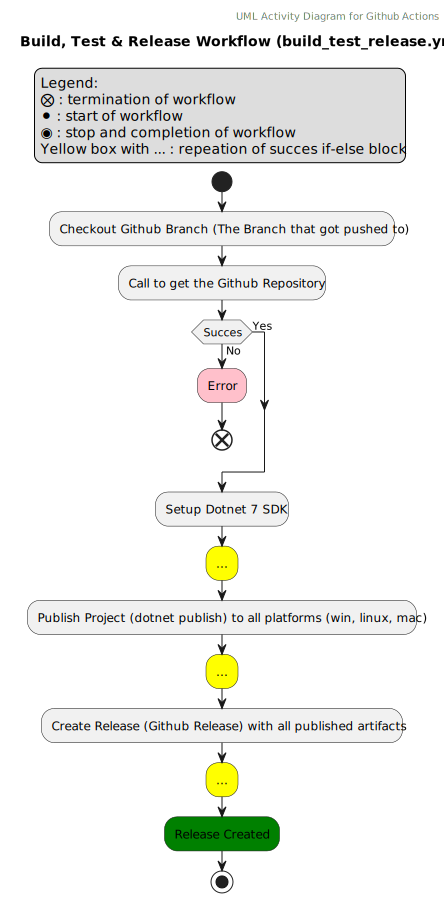
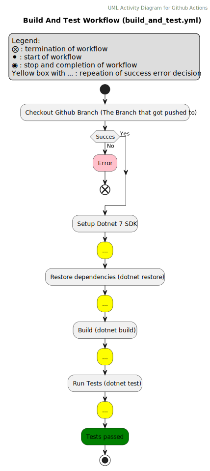
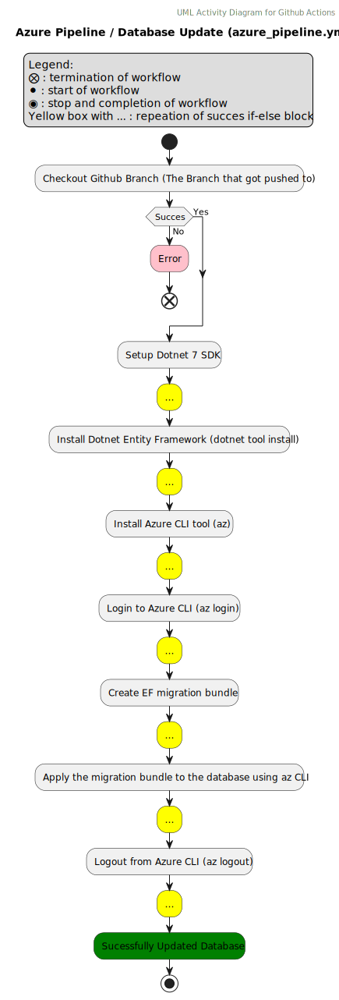
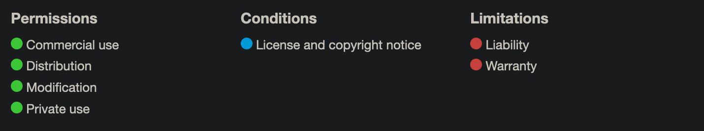
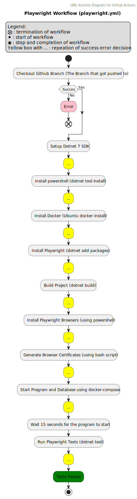
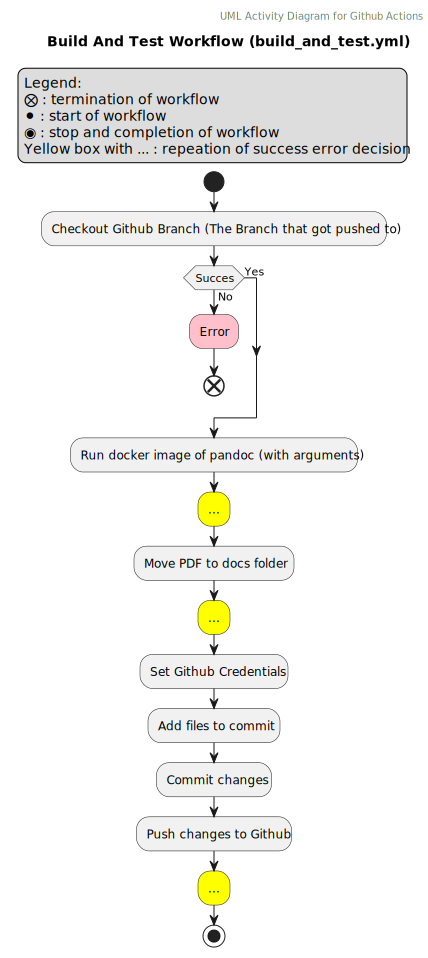

# Table Of Content

//TODO: Create a ToC

# Design and Architecture of _Chirp!_

## Domain model

Here comes a description of our domain model.


## Architecture — In the small

## Architecture of deployed application

## User activities

## Sequence of functionality/calls trough _Chirp!_

# Process

## Build, test, release, and deployment  
The group employed the use of Github Workflows/Actions to build, test, release and deploy the application to Azure. The UML activity diagrams below show how each of the workflows work using UML activity and UML sequence diagrams. 

Via the use of two workflows (see figure ?? and ??) the group ensured that the program would always pass the tests when anything got pushed to the main branch. More importantly, it provided some security to the main branch when trying to merge branches into main via Github Pull Requests. These workflows also ensured that the release-build of the program was able to build and passed most tests (all tests excluding the UI tests) before getting put into a release, minimizing the chances that a release would be broken. 

#### Test and Release UML Activity diagrams
[](https://github.com/ITU-BDSA23-GROUP10/Chirp/blob/main/docs/report_diagrams/UML_activity_diagrams/build_test_release_UML_act.svg)
*- Figure ??*

[](https://github.com/ITU-BDSA23-GROUP10/Chirp/blob/main/docs/report_diagrams/UML_activity_diagrams/UML_activity_diagrams/build_test_UML_act.svg)
*- Figure ??*

Deployment was done on Microsoft Azure using their webapp and database features. The Azure webapp automatically updates when changes are pushed to main using the <code>main_bdsagroup10chirprazor.yml</code> file which on Github is the "Build and deploy ASP.Net Core app to Azure Web App - bdsagroup10chirprazor" action. This will build, publish and send the application to our Azure webapp, which then runs the released build. The database is a MySQL server database hosted on Azure. We also deploy the database schema to the database using workflows. This is done using the <code>azure_pipeline.yml</code> file which on Github is the "Azure Pipeline" action. This gets the current database migration from the main branch on Github and applies them to the Azure database. 

#### Azure Deployment Workflow Activity Diagrams
[](https://github.com/ITU-BDSA23-GROUP10/Chirp/blob/main/docs/report_diagrams/UML_activity_diagrams/azure_pipeline_UML_act.svg)
*- Figure ??*

## Team work

## How to make _Chirp!_ work locally
For a full guide on how to run the project locally see the ReadMe.md on the public repository (This includes many other ways of running the program and more explanations): [Chirp ReadMe.md](https://github.com/ITU-BDSA23-GROUP10/Chirp/blob/main/README.md) 

This part will include the ways to run it locally fully using docker, or running it locally with dotnet run / the release executables.

### How to Run the project using dotnet run and a MySQL docker image:
If Docker is not installed on your computer, please follow the installation guide on this website: [Install guide for Docker](https://docs.docker.com/get-docker/) //TODO: visited 19/12

First you will have to install a docker image of MySQL server. To do so, run the code below in a terminal (Remember to set the password by replacing "yourStrong(!)Password", and the password has to be a strong password, otherwise the server wont run):

```
$ docker run -e "ACCEPT_EULA=Y" -e "MSSQL_SA_PASSWORD=yourStrong(!)Password" -p 1433:1433 -d mcr.microsoft.com/mssql/server:2022-latest
```

After running the above, check if the container is running:

``` 
$ docker ps
```

*If the container is not showing up on the list please refer to the ReadMe on possible ways to solve this issue*

After ensuring that the Docker container is running, create a user secret with the connection string to your container from the Chirp directory (Please ensure you have the dotnet user-secrets tool first: [Nuget Page For Dotnet user-secrets tool install](https://www.nuget.org/packages/dotnet-user-secrets)):
```
$ cd ./src/Chirp.Web && dotnet user-secret init
```
Now you can set the user secrets:
```
dotnet user-secrets set "ConnectionStrings:ConnectionString" "Data Source=localhost,1433;Initial Catalog=Chirp;User ID=sa;Password=yourStrong(!)Password;Connect Timeout=30;Encrypt=False;TrustServerCertificate=False;ApplicationIntent=ReadWrite;MultiSubnetFailover=False"
```
After this you can run the program using dotnet run from the Chirp.Web directory or the release latest release executable from the github repository (an OS specific guide on how to do this can be found in the full ReadMe):  [Releases](https://github.com/ITU-BDSA23-GROUP10/Chirp/releases)
```
$ dotnet run
```

### Running the program only using docker
The program has a <code>Dockerfile</code> as a well as a <code>docker-compose</code> file which will run the program and database fully within docker containers. To do so just run the following docker compose command in your terminal while within the Chirp directory:
```
$ docker compose up
```

## How to run test suite locally
For the playwright tests to work, an installation of Docker is required. Please refer to the [run section](#how-to-run-the-project-using-dotnet-run-and-a-mysql-docker-image) for instructions on this. 

### Running all tests (Except playwright)
To run all tests except the playwright tests, run the command below in your terminal while within the Chirp directory:
```
$ dotnet test
```

### To run the playwright tests
The program must be running the background for the playwright tests to function, as it tries to access the application. Running the program through the docker setup will not work for this, as it seems to have some problems with the certificates as well as the browsers. So please refer to how to run the program locally using either the release build or dotnet run. You can then run the playwright tests by running the following command in your terminal while within the <code>Chirp/test/PlaywrightTests</code> directory
```
$ dotnet test
```

# Ethics

## License  
The group has chosen the MIT open source software license. You can read a small summary from Github's license page below as well as see a very simple overview of the perls and constraints that this license provides.

[](https://choosealicense.com/licenses/mit/)

>MIT License
>
>Copyright (c) [year] [fullname]
>
>Permission is hereby granted, free of charge, to any person obtaining a copy of this software and associated documentation files (the "Software"), to deal in the Software without restriction, including without limitation the rights to use, copy, modify, merge, publish, distribute, sublicense, and/or sell copies of the Software, and to permit persons to whom the Software is furnished to do so, subject to the following conditions:
>
>The above copyright notice and this permission notice shall be included in all copies or substantial portions of the Software.
>
>THE SOFTWARE IS PROVIDED "AS IS", WITHOUT WARRANTY OF ANY KIND, EXPRESS OR IMPLIED, INCLUDING BUT NOT LIMITED TO THE WARRANTIES OF MERCHANTABILITY, FITNESS FOR A PARTICULAR PURPOSE AND NONINFRINGEMENT. IN NO EVENT SHALL THE AUTHORS OR COPYRIGHT HOLDERS BE LIABLE FOR ANY CLAIM, DAMAGES OR OTHER LIABILITY, WHETHER IN AN ACTION OF CONTRACT, TORT OR OTHERWISE, ARISING FROM, OUT OF OR IN CONNECTION WITH THE SOFTWARE OR THE USE OR OTHER DEALINGS IN THE SOFTWARE.  

//TODO: figure out how we want to source from things
Source: [Github choose a license site](https://choosealicense.com/licenses/mit/)

The group chose this license as it was a good fit for the groups' requirements of an open source license, in that it basically has no restrictions for any end-user, or anyone who wants to work with the codebase. We also sign off any warranty or liability, which is great for a small group project that we more than likely will not work on further in the future.

## LLMs, ChatGPT, Copilot, and others
The use of LLMs like ChatGPT and Copilot has been documented on github commits as a co-author when used. The use of Copilot was almost entirely used for writing comments in the code as documentation, as well as translating a bash script into a powershell script for the docker setup. 

 You can see the number of these commits on the page linked here: [ChatGPT Co-authored commits](https://github.com/ITU-BDSA23-GROUP10/Chirp/graphs/contributors). Note that the page showing the [actual commits](https://github.com/ITU-BDSA23-GROUP10/Chirp/commits?author=fromchatgpt) it worked on does not show any of the commits that it contributed on, but it is counted in the contribution section linked to before.


# References 
This section is a collection of the references used in this report with date stamps. The references are in the order they appear in the report are and numbered the same here as in the report.


# Appendix

## 1. Links to Github repository and Publicly hosted Webapp version of Chirp

**Github Repository:**  
https://github.com/ITU-BDSA23-GROUP10/Chirp

**Chirp Webapp On Azure**  
https://bdsagroup10chirprazor.azurewebsites.net/

## 2. Extra workflow diagrams
These are diagrams that show off the workflows that weren't mentioned in the report but are present on the Github Repository

### 2.1 Playwright Test Workflow
***Sadly due to the limitations of our docker compose setup in regards to getting the browser certificates working, the playwright tests will more than likely fail (in this workflow) but here is the current logic for the playwright test workflow.***

[](https://github.com/ITU-BDSA23-GROUP10/Chirp/blob/main/docs/report_diagrams/UML_activity_diagrams/playwright_UML_act.svg)
*- Figure ??*


### 2.2 Pandoc PDF Convert Workflow
This is the pandoc CLI tool workflow that converts the report.md file into a .pdf any time there was a change within the docs folder on the Github Repository

[](https://github.com/ITU-BDSA23-GROUP10/Chirp/blob/main/docs/report_diagrams/UML_activity_diagrams/pandoc_pdf_UML_act.svg)
*- Figure ??*
