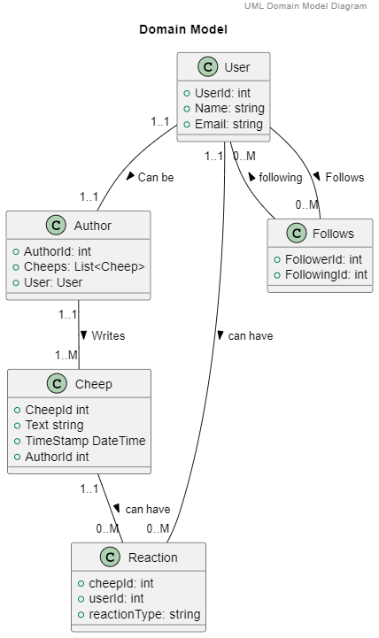
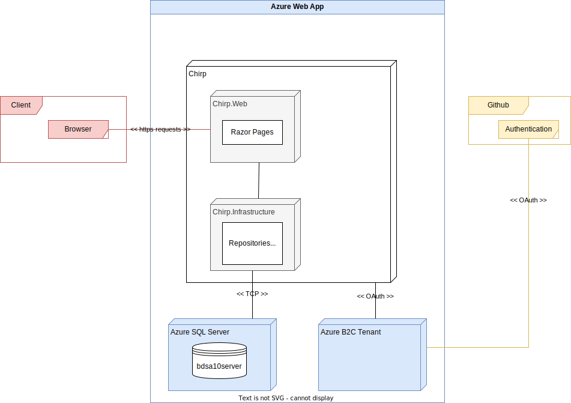

# Design and Architecture of _Chirp!_

Chirp! is a mini social media platform based around user generated "cheeps", 160 character text-based messages which stores the input of the cheep author's shared message. It is hosted on Azure App Service and utilizes ASP.Net 7.

## Domain model

The Chirp! domain model represents the fundamental structure and behavior of the application. It describes how users, who can be authors once they write one or many cheeps, also can react to cheeps and follow other users. The Follows, Reaction, Author, Cheep, and User classes manage these relationships and interactions on the platform.

## Architecture — In the small

## Architecture of deployed application

### Architecture
The project uses the Razor Pages framework to serve Chirp.Web. Chirp.Web effectively sets up the GUI for the website, and is a blend of static html components like images, css, javascript files, viewcomponents, and razor pages, all of them collectively handles the user's experience on the Chirp! platform.

The backend of the website is handled by Chirp.Core and Chirp.Infrastructure. As its innermost layer, Chirp.Core handles the Data Transfer Objects (DTOs) and the interfaces. The DTOs are data carriers, exchanging data related to authors, cheeps, users, follows, and reactions between the different parts of the project.

Chirp.Infrastructure is the persistent data layer of the Chirp! application. This is where models for Author, Cheep, Follows, Reaction, User, and their corresponding repositories exist, handling the actual data operations with the database. It also includes the Dbinitializer, which helps manage the database state.

### Client-server communication
The database server is hosted on SQL Server on Azure App Service. The database server works with the Chirp.Infrastructure layer where it stores and retrieves data as requested by the application.

The communication between the client application and the server is carried out through HTTP and HTTPS protocols. These protocols are safely handled by the Azure App Service using their TCP/IP service, giving high certainty of reliable data transmissions.

When a user interacts with the Chirp! website, an HTTP request is sent to the Azure server.

For instance, when a user posts a new cheep, the client application sends a request to the server to store that information in the database. The server then processes this request with the help of Chirp.Core and Chirp.Infrastructure, which handle data operations with the database. (REFERENCE sequence diagram)

The server, after storing the cheep in the database, sends a response back to the client application, signifying that the operation was successful and updates accordingly. This kind of request-response communication happens every time a user interacts with the website and uses its functions.

Both the Chirp! application and the SQL Database are hosted on Azure App Service, where the Azure services provide a cloud-based platform for deployment, management, and scalability. Hosting on Azure also ensures greater security with a free https certificate, secures automatic scaling, and ease of use for deployment through Github pushes.

The Azure services hosting Chirp! utilize ACID properties in their SQL Server, ensuring all-or-nothing transactions for data consistency. Concurrency is managed through the SQL Server's locking mechanism and conflict detection in Entity Framework, which is also part of the Chirp! application. During a transaction, the accessed data is locked to prevent conflicting modifications. Entity Framework also checks for changes made by other users since the last read, helping to resolve any conflicts. Furthermore, data integrity within Chirp! is maintained by enforcing constraints (like UNIQUE, FOREIGN KEY, NOT NULL) in the SQL Server database.

### User Authentication
User authentication in Chirp! is managed through GitHub's OAuth authentication service. This service enables users to log into the application using their GitHub accounts, providing an easy login experience.

When a user attempts to log in, the application directs them to GitHub's OAuth login page. After the user enters their GitHub credentials and grants the necessary permissions, GitHub sends an authorization code back to the Chirp! application. This authorization code is handled by an ASP.NET handler form in Chirp! which then exchanges it for an access token.

The access token is a unique string that represents the user's authorization to access their GitHub data. This token is stored securely in the user's session and is used to authenticate subsequent requests made by the user.

By delegating authentication to GitHub, Chirp! can provide a secure and user-friendly login process. It also reduces the risk of storing and managing sensitive user data on the Chirp! server, as the user's password is never directly handled by the application.

### External services
Besides using Github for Chirp!'s login authentication, Chirp! also uses Github's profile images as a user's image avatar in the application. If the Chirp! user has no avatar uploaded to their Github profile, Github will serve the default avatar image.

Chirp! also uses the JQuery library as a dependancy to enhance Chirp! users with an AJAX script to dynamically load the follow, unfollow, and reaction forms. This ensures better user experience and fewer elements loaded once interacted with, compared to that of the entire webpage being reloaded on each button interaction.

Lastly, when a cheep author includes a YouTube URL within a cheep, the Chirp! application utilizes regular expressions (regex) to extract a unique 11-character video ID from the URL. This ID is then used to generate an iframe that embeds the corresponding YouTube video directly into the cheep. The embedded YouTube video also embeds YouTube specific scripts and css files. This process allows videos to be played within the Chirp! platform, enhancing the user experience by eliminating the need to navigate away from the site to view video content.

## User activities

## Sequence of functionality/calls trough _Chirp!_

# Process

## Build, test, release, and deployment  
The group employed the use of Github Workflows/Actions to build, test, release and deploy the app to Azure. The UML activity diagrams below show how each of the Workflows work 

## Team work

## How to make _Chirp!_ work locally
For a full guide on how to run the project locally see the ReadMe.md on the public repository: [Chirp ReadMe.md](https://github.com/ITU-BDSA23-GROUP10/Chirp/blob/main/README.md)  

<!---->

## How to run test suite locally

# Ethics

## License  
The group has chosen the MIT open source software license 

>MIT License
>
>Copyright (c) [year] [fullname]
>
>Permission is hereby granted, free of charge, to any person obtaining a copy
>of this software and associated documentation files (the "Software"), to deal
>in the Software without restriction, including without limitation the rights
>to use, copy, modify, merge, publish, distribute, sublicense, and/or sell
>copies of the Software, and to permit persons to whom the Software is
>furnished to do so, subject to the following conditions:
>
>The above copyright notice and this permission notice shall be included in all
>copies or substantial portions of the Software.
>
>THE SOFTWARE IS PROVIDED "AS IS", WITHOUT WARRANTY OF ANY KIND, EXPRESS OR
>IMPLIED, INCLUDING BUT NOT LIMITED TO THE WARRANTIES OF MERCHANTABILITY,
>FITNESS FOR A PARTICULAR PURPOSE AND NONINFRINGEMENT. IN NO EVENT SHALL THE
>AUTHORS OR COPYRIGHT HOLDERS BE LIABLE FOR ANY CLAIM, DAMAGES OR OTHER
>LIABILITY, WHETHER IN AN ACTION OF CONTRACT, TORT OR OTHERWISE, ARISING FROM,
>OUT OF OR IN CONNECTION WITH THE SOFTWARE OR THE USE OR OTHER DEALINGS IN THE
>SOFTWARE.  

//TODO: figure out how we want to source from things VISITED 18/12
Source: [Github choose a license site](https://choosealicense.com/licenses/mit/)

The group chose this license as it was a good fit for the groups requirements of an open source license in that it basically has no restrictions for any end user or somebody who wants to work with the codebase. We also sign off any warranty or liability which is great for a small group project that we more than likely wont want to take further in the future.

## LLMs, ChatGPT, CoPilot, and others
The use of LLMs like ChatGPT and Copilot has been documented on github commits as a co-author when used. You can see the number of these commits on the page linked here: [ChatGPT Co-authored commits](https://github.com/ITU-BDSA23-GROUP10/Chirp/graphs/contributors). Sadly the page that shows the actual commits doesn't have the commits that it contributed on as these were done on separate branches whose commits seem to not carry over to the main branch's working tree. 