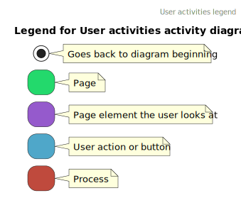
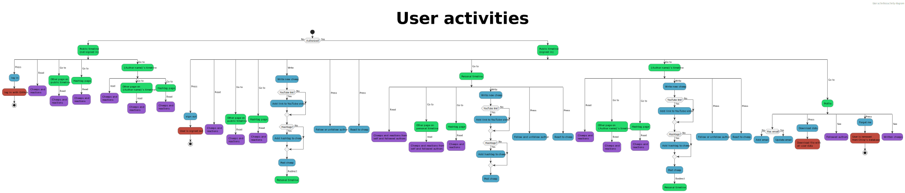
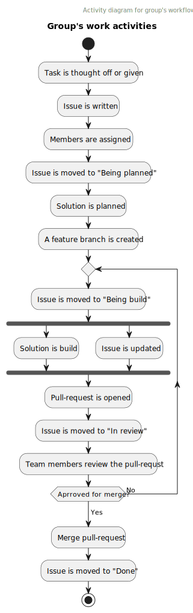

# Design and Architecture of _Chirp!_

## Domain model

Here comes a description of our domain model.

## Architecture — In the small

## Architecture of deployed application

## User activities
The User activities diagram shows what is possible for a user to do on our Chirp application. Both when authenticated and unauthenticated.

[Web version of *User activities* diagram](https://www.plantuml.com/plantuml/svg/xLXBJzj04BxdLupK0-5GgIhG5f1Q41LmQYCUgZYXINOSZrZlMhjhebBrlrTU9nqCAyl2LQ5LSdBMtyvZvlEtZmCVq8Mgq51vSjSu2tpBWSbVAyQvmsBaRzYKwB202mwQZgq9vtn7yE7DA2TKvE3IamEPkNhy3YiJePxu43QAdaUSmVYm2hbrV4VgqoQ4d0oClzZD4G30gxTRQlVTR6zIJJNF8711cWt5TsDZ0tYU6rB0PdC_3lfISnZ1ylVwuyIHzyshQ6yxm_UptJrjvy3ctlWqsyOjjHo71OSSJZYSLbF1-61ByG4uHpRtF9qHgdi6TtTsS3RREyg9IWzerEzNZkegMEC5VSDQTvW-iH3i2Yr5-HfoSb3YdC0Al6oNQlzPGpn5dmUSno2VDv8V3Sl0O44_DtoYFa8TCUOapkvOE-9jnPoEEnrxPxFbrv7P2yqbpGfXnX-FaengkjlwGzeJZA_8zz2Q9-fCFGri5HuhJPH3zj0O5inQQVuPfVdcED3ZdiTXCBI0MUr50FLQTsMhYsfAeDdSh5OxeU13KuTAHIG42wkPjwp8Yj58ucQz5B9prdAwh8tlvp1lq12i9D37brYPM1zaRdSjkx-VOwkrNO1rK9ciUSQeTaCDdzNTbXG7acz2pbk3kkUgqaVZX8-GELj02-v9Pn7Kr8JKiYf_STKfqocBLVVoatoMvQWTfQISr9HUkj9FMvweBydlFl7jzzUQ_dhJstTQU_hJ92qNQIr2ez9YDDnJMfpwxclMs-7rTdXOb2zVVjRoOzr_e3uJPpFMQR5fDnEeGDQjUw6kPaPqgeETDBWi5GQIoLsD7bxVptPXj4K52WCA1EHmA92wIirjL0k7khcmIvZe6TyvKLfMZeTjjdhGsCqfG27kayTYHuMzfRQqnItYKSwktF0nyobwCICdvm7Pro8No3JKVyADGgJB0HbL5VeN)

## Sequence of functionality/calls trough _Chirp!_

# Process

## Build, test, release, and deployment  
The group employed the use of Github Workflows/Actions to build, test, release and deploy the app to Azure. The UML activity diagrams below show how each of the Workflows work 

## Team work

//TODO: Add picture of project board 

Above is an image of the project board for our chirp project. While the vast majority of issues are done and closed, some issues are still open.

**Overview of uncompleted issues:**
| Issue | Description | Not completed because: |
| ----------- | ----------- | ----------- |
| [#175](https://github.com/ITU-BDSA23-GROUP10/Chirp/issues/175) (Bugs) | Make playwright UI tests able to run  with a workflow through GitHub actions. | Problems with getting playwright test to run in “Headless” mode. Because running UI tests on GitHub actions was not an important requirement for the project, the issue was not prioritized. |
| [#263](https://github.com/ITU-BDSA23-GROUP10/Chirp/issues/263) (Bugs) | When running integration tests on a unix  based system, the tests would give a  `System.InvalidOperationException`. | Since the exception didn’t stop the tests from running and passing, the issue was not prioritized. |
| [#225](https://github.com/ITU-BDSA23-GROUP10/Chirp/issues/225) (Not started) | Be able to run `playwright` tests on a dockerized container of the project. | The scope of this issue was too big for the deadline of the project, and not a necessary addition. |
| [#279](https://github.com/ITU-BDSA23-GROUP10/Chirp/issues/279) (Not started) | Change general exception throws to be more specific to the reason it was thrown. | Since most of the program uses general exceptions, solving this issue would take some time. Because this issue didn’t impact the performance or the functionality of the program, and due to the deadline approaching, it was decide that other issues would be prioritized.  |

### Group's work activities

[Web version of *Group's work activities* diagram](https://www.plantuml.com/plantuml/svg/TP6zxjD04CJxUufL6lufyWA910b2GYb0IAIXGfjuR9zo7yVUdYtUdhDZWWjovSpFCxlUOrOMBTwHWltFCSgzTN4qFRY1qEccTh3wcnhBdR2dDWfr4ajwb-a9grK7-hoIYHyVMcGoSuNPNpZVoMRIFfQkLufjIrEQ7H0EPd_EkM3oHx6gi_G5_Wh9n0BYd6qNqAn97mSqf94s7s53HybngCYcCj-ZAsfZcB15hkg9Mh0M0Ls5mwsVt9jKgRfa10ciXkfxtN4jrjM6cMhhfeQMjwvyKFyWuevjMD1rUaaDAnOIeNacxhyLvtQ2NmLP9p8cX0g-dEuSI31OZ9k5kO0z-UKFFYpI7fJ-1cSzB2lJs5i7UZibaJbmkhA7TFYmdLhUliQjsRt_WJmVfUgKLkFz_oIVOa2T9MjCveZG5E_-0000)

The group would create issues after a lecture, based on the project work given and tasks that needed to be solved. New issues where added to the “Not started” column on the project board or “Bugs” if the issue pertained to a bug.

How work was conducted on the issues, can be seen in the diagram above [team workflow diagram].

Assigned group members take responsibility for updating the issue and the project board.

The amount of group members on one issue would vary depending on the issue. Smaller or more specialized issues would often only be assigned one group member. A specialized issue could be one that pertained to a subject that one group member was significantly more experience in than other members were.

To automate closing and moving of issues on the project board when a pull-request for an issues was merged, the group used GitHub keywords like “Resolves” and “Closes” with links to the issues.

## How to make _Chirp!_ work locally
For a full guide on how to run the project locally see the ReadMe.md on the public repository: [Chirp ReadMe.md](https://github.com/ITU-BDSA23-GROUP10/Chirp/blob/main/README.md)  

<!---->

## How to run test suite locally

# Ethics

## License  
The group has chosen the MIT open source software license 

>MIT License
>
>Copyright (c) [year] [fullname]
>
>Permission is hereby granted, free of charge, to any person obtaining a copy
>of this software and associated documentation files (the "Software"), to deal
>in the Software without restriction, including without limitation the rights
>to use, copy, modify, merge, publish, distribute, sublicense, and/or sell
>copies of the Software, and to permit persons to whom the Software is
>furnished to do so, subject to the following conditions:
>
>The above copyright notice and this permission notice shall be included in all
>copies or substantial portions of the Software.
>
>THE SOFTWARE IS PROVIDED "AS IS", WITHOUT WARRANTY OF ANY KIND, EXPRESS OR
>IMPLIED, INCLUDING BUT NOT LIMITED TO THE WARRANTIES OF MERCHANTABILITY,
>FITNESS FOR A PARTICULAR PURPOSE AND NONINFRINGEMENT. IN NO EVENT SHALL THE
>AUTHORS OR COPYRIGHT HOLDERS BE LIABLE FOR ANY CLAIM, DAMAGES OR OTHER
>LIABILITY, WHETHER IN AN ACTION OF CONTRACT, TORT OR OTHERWISE, ARISING FROM,
>OUT OF OR IN CONNECTION WITH THE SOFTWARE OR THE USE OR OTHER DEALINGS IN THE
>SOFTWARE.  

//TODO: figure out how we want to source from things
Source: [Github choose a license site](https://choosealicense.com/licenses/mit/)

The group chose this license as it was a good fit for the groups requirements of an open source license in that it basically has no restrictions for any end user or somebody who wants to work with the codebase. We also sign off any warranty or liability which is great for a small group project that we more than likely wont want to take further in the future.

## LLMs, ChatGPT, CoPilot, and others
The use of LLMs like ChatGPT and Copilot has been documented on github commits as a co-author when used. You can see the number of these commits on the page linked here: [ChatGPT Co-authored commits](https://github.com/ITU-BDSA23-GROUP10/Chirp/graphs/contributors). Sadly the page that shows the actual commits doesn't have the commits that it contributed on as these were done on separate branches whose commits seem to not carry over to the main branch's working tree. 