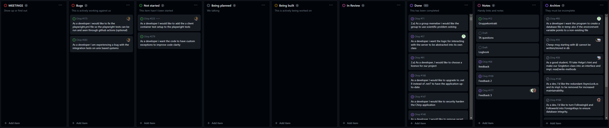

# Design and Architecture of _Chirp!_

Chirp! is a mini social media platform based around user generated "cheeps", 160 character text-based messages which stores the input of the cheep author's shared message. It is hosted on Azure App Service and utilizes ASP.Net 7.

## Domain model

The Chirp! domain model represents the structure and user behavior of the application. It describes how users, who can specialize their account to be authors once they write one or many cheeps, can also react to cheeps and follow other users. The Follows, Reaction, Author, Cheep, and User classes manage these relationships and interactions on the platform.


## Architecture — In the small

### Chirp.core Layer:
The core layer is where we place our interfaces and DTO. This layer is oblivious to external concerns such as the database context(infrastructure) or razer pages(Web). 


### Chirp.Infrastructure Layer:
The Infrastructure layer is responsible for implementing the details of the database and Initializing the database. Database creation and migrations are constructed here with EF core and the Models.


### Chirp.Web Layer:
The Web Layer is where the UI interface is placed, and as such have all the cshtml file with their corresponding cs file. Within the program.cs is where the dependencies are built to the others layers.


The Onion Architecture provides a clear separation of concerns and upholds the Dependency Inversion Principle by keeping every layer unaware of the layer above itself. This layered approach facilitates testability by decoupled components, so each can be tested in isolation. The architecture hereby enables a stronger use of dependency injection to ensure more class are independent from eachother.

## Architecture of deployed application
When a user interacts with the Chirp website, a HTTPS request is sent to the Azure server, and any following interactions made are as shown on the diagram below.


The communication between the client application and the server is carried out through HTTPS protocols to Chirp.Web. These protocols are safely handled by the Azure Web App using their TCP/IP service, giving high certainty of reliable data transmissions.

The database server is hosted on a SQL Server on Azure Web App. The database server works with the Chirp.Infrastructure layer where it stores and retrieves data as requested by the application. The Chirp.Infrastructure then communicates with Chirp.Web and ensures the data flow.

### User Authentication
User authentication in Chirp is managed through Azure's B2C and GitHub's OAuth authentication service.
When a user attempts to log in, the application uses Azure's B2C service which connects them to GitHub's OAuth login page. After the user enters their GitHub credentials and grants the necessary permissions, GitHub sends an authorization code back. This authorization code is handled by an ASP.NET handler form in Chirp which then exchanges it for an access token.

The access token is a unique string that represents the user's authorization to access their GitHub data. This token is stored securely in the user's session and is used to authenticate subsequent requests made by the user.

By delegating authentication to GitHub, Chirp can provide a secure and user-friendly login process. It also reduces the risk of storing and managing sensitive user data on the Chirp server, as the user's password is never directly handled by the application.

### External services
Besides using Github for Chirp's login authentication, Chirp also uses Github's profile images as a user's image avatar in the application. If the Chirp user has no avatar uploaded to their Github profile, Github will serve the default avatar image.

Chirp also uses the JQuery library as a dependancy to enhance Chirp users with an AJAX script to dynamically load the follow, unfollow, and reaction forms. This ensures better user experience and fewer elements loaded once interacted with, compared to that of the entire webpage being reloaded on each button interaction.

Lastly, when a cheep author includes a YouTube URL within a cheep, the Chirp application utilizes regular expressions (regex) to extract a unique 11-character video ID from the URL. This ID is then used to generate an iframe that embeds the corresponding YouTube video directly into the cheep.

## User activities
The User activities diagram shows what is possible for a user to do on our Chirp application. Both when authenticated and unauthenticated.


[Web version of *User activities* diagram](https://www.plantuml.com/plantuml/svg/xPZVJzim4CVV-rUSj0VAmwHfm3P0sa1CmDDMyKCJJyYDByq9nuxi2zKsxNyVILgk0IkAIWNhH9xIv7m_pjz-xFWWiF9SvWRAWFvQ9Kotn8JXMfEQU9KFmWtPGjtTmGMnmMDd-Pn-8NnwDyXGQVHm6T23Z9pV_eIv2wu6FZGRr947bCBmiEJC-Jkd-iicS8OMXj_SvW3khZVlj_JkXsHlL8uD9S2Keo6BzRkXTGo19XOraDtShn-6mX0FO7Qz_Jpo64BpglQtdQgFoUwUSHCWk_1yd6whBJrx3bFY34w8Jykns0HsXSG0DL5a5oATeT8B3dTtTbIIx1rbY4K0PVNzAuzL5vmDOdr3ndIuFd70JgpdJVdE6Neer0J1YNdHRjN-YwPugaB6Qb8b-SAP_6vK1bRb-6SZHFeZqX5dNlBiphKZtrREqRpZkNTFjbpTbVsBjKHL8SfOVPPejSpk_Gyq0M5uXQ47QvRaJ3KCNCcFILFZaC8CO6ApDgHv9SqFJuoFvxn-31Qda5HHnA1QwwvSUL6E4GpPc_bg9n9ywEfGwzeIsC5yv2rfNAY_4h6ibpDzKzeAEkjDw1SmctMIdHJG9vPu6Rd0CbPcGfF7X1_FtGXzS5OPaLAVAUZusnqxOzmKd8VIfiszgY7vLCTdbKWYdUclsNvrDtwMGAF865BlScYP1pHfRTJq1FMiAy-uM1NnaiMhNuiYNs0LQsKf9KTGr0D7_P6q19RYk8WZep-Y-cEgV-muilhB98wBA8kKrH4OhJHI74uTsw7dsaMVhVykUlMrh3L_Nl7p7FY9xvfwxY1MIY_d_mDuZRnBoSHPrTO2OAx8j4wZEhJGMCS4qAcYoq8hHXaSqSaA-_lLJQrnIeDMhCHauPDKJAekDMTWBJjbccF2Y8kU-PqZngbq7DchhLR6Ve8CkOIFVenxpDqjjiZOx32FClB5HgWh7wiWRkHx_GdLLunaj8tqbpZ7gELoW5QNkVaB)

## Sequence of functionality/calls trough _Chirp!_

The UML sequence diagram below shows an unauthorised user successfully accessing the webapp's root endpoint, public timeline, and the execution of actions until the page is rendered.


# Process

## Build, test, release, and deployment  
The group employed the use of Github Workflows/Actions to build, test, release and deploy the application to Azure. The UML activity diagrams below show how each of the workflows work using UML activity and UML sequence diagrams. 

Via the use of two workflows (see UML Activity Diagram for Github Actions: Test and Release and UML Activity Diagram for Github Actions: Build and Release) the group ensured that the program would always pass the tests when anything got pushed to the main branch. More importantly, it provided some security to the main branch when trying to merge branches into main via Github Pull Requests. These workflows also ensured that the release-build of the program was able to build and passed all tests (all tests excluding the UI tests) before getting put into a release, minimizing the chances that a release would be broken. 

#### Test and Release UML Activity diagrams
[](https://github.com/ITU-BDSA23-GROUP10/Chirp/blob/main/docs/report_diagrams/UML_activity_diagrams/build_test_release_UML_act.svg)

[](https://github.com/ITU-BDSA23-GROUP10/Chirp/blob/main/docs/report_diagrams/UML_activity_diagrams/UML_activity_diagrams/build_test_UML_act.svg)

Deployment was done on Microsoft Azure using their web app and database features. The Azure web app automatically updates when changes are pushed to main using the <code>main_bdsagroup10chirprazor.yml</code> file which on Github is the "Build and deploy ASP.Net Core app to Azure Web App - bdsagroup10chirprazor" action. This will build, publish and send the application to our Azure webapp, which then runs the released build. The database is a MySQL server database hosted on Azure. We also deploy the database schema to the database using workflows. This is done using the <code>azure_pipeline.yml</code> file which on Github is the "Azure Pipeline" action. This gets the current database migration from the main branch on Github and applies them to the Azure database. 

#### Azure Deployment Workflow Activity Diagrams
[](https://github.com/ITU-BDSA23-GROUP10/Chirp/blob/main/docs/report_diagrams/UML_activity_diagrams/azure_pipeline_UML_act.svg)


## Team work



Above is an image of the project board for our chirp project. While the vast majority of issues are done and closed, some issues are still open.

**Overview of uncompleted issues:**
| Issue | Description    | Not completed because: |
|:------|:---------------|:-----------------------|
| [#175](https://github.com/ITU-BDSA23-GROUP10/Chirp/issues/175) (Bugs) | Make playwright UI tests able to run<br> with a workflow through GitHub actions. | Problems with getting playwright test to run in “Headless” mode.<br>Because running UI tests on GitHub actions was not an important requirement for the project, the issue was not prioritized. |
| [#263](https://github.com/ITU-BDSA23-GROUP10/Chirp/issues/263) (Bugs) | When running integration tests on a unix<br> based system, the tests would give an exception. | Since the exception didn’t stop the tests from running and passing, the issue was not prioritized. |
| [#225](https://github.com/ITU-BDSA23-GROUP10/Chirp/issues/225) (Not started) | Be able to run `playwright` tests on a dockerized container of the project. | The scope of this issue was too big for the deadline of the project, and not a necessary addition. |
| [#279](https://github.com/ITU-BDSA23-GROUP10/Chirp/issues/279) (Not started) | Change general exception throws to be more specific to the reason it was thrown. | Since most of the program uses general exceptions, solving this issue would take some time. Because this issue didn’t impact the performance or the functionality of the program, and due to the deadline approaching, it was decide that other issues would be prioritized.  |

### Group's work activities


[Web version of *Group's work activities* diagram](https://www.plantuml.com/plantuml/svg/TP6zxjD04CJxUufL6lufyWA910b2GYb0IAIXGfjuR9zo7yVUdYtUdhDZWWjovSpFCxlUOrOMBTwHWltFCSgzTN4qFRY1qEccTh3wcnhBdR2dDWfr4ajwb-a9grK7-hoIYHyVMcGoSuNPNpZVoMRIFfQkLufjIrEQ7H0EPd_EkM3oHx6gi_G5_Wh9n0BYd6qNqAn97mSqf94s7s53HybngCYcCj-ZAsfZcB15hkg9Mh0M0Ls5mwsVt9jKgRfa10ciXkfxtN4jrjM6cMhhfeQMjwvyKFyWuevjMD1rUaaDAnOIeNacxhyLvtQ2NmLP9p8cX0g-dEuSI31OZ9k5kO0z-UKFFYpI7fJ-1cSzB2lJs5i7UZibaJbmkhA7TFYmdLhUliQjsRt_WJmVfUgKLkFz_oIVOa2T9MjCveZG5E_-0000)

The group would create issues after a lecture, based on the project work given and tasks that needed to be solved. New issues where added to the “Not started” column on the project board or “Bugs” if the issue pertained to a bug.

How work was conducted on the issues, can be seen in the diagram above [team workflow diagram].

Assigned group members take responsibility for updating the issue and the project board.

The amount of group members on one issue would vary depending on the issue. Smaller or more specialized issues would often only be assigned one group member. A specialized issue could be one that pertained to a subject that one group member was significantly more experience in than other members were.

To automate closing and moving of issues on the project board when a pull-request for an issues was merged, the group used GitHub keywords like “Resolves” and “Closes” with links to the issues.


## How to make _Chirp!_ work locally
For a full guide on how to run the project locally see the ReadMe.md on the public repository (This includes many other ways of running the program and more explanations): [Chirp ReadMe.md](https://github.com/ITU-BDSA23-GROUP10/Chirp/blob/main/README.md) 

This part will include the ways to run it locally fully using Docker, or running it locally with dotnet run / the release executables.

### How to Run the project using dotnet run and a MySQL Docker image:
If Docker is not installed on your computer, please follow the installation guide on this website: [Install guide for Docker](https://docs.docker.com/get-docker/)

First you will have to install a Docker image of MySQL server. To do so, run the code below in a terminal (Remember to set the password by replacing "yourStrong(!)Password", and the password has to be a strong password, otherwise the server wont run):

```
$ docker run -e "ACCEPT_EULA=Y" -e "MSSQL_SA_PASSWORD=yourStrong(!)Password" -p 1433:1433 -d mcr.microsoft.com/mssql/server:2022-latest
```

After running the above, check if the container is running:

``` 
$ docker ps
```

*If the container is not showing up on the list please refer to the ReadMe on possible ways to solve this issue*

After ensuring that the Docker container is running, create a user secret with the connection string to your container from the Chirp directory (Please ensure you have the dotnet user-secrets tool first: [Nuget Page For Dotnet user-secrets tool install](https://www.nuget.org/packages/dotnet-user-secrets)):
```
$ cd ./src/Chirp.Web && dotnet user-secret init
```
Now you can set the user secrets:
```
dotnet user-secrets set "ConnectionStrings:ConnectionString" "Data Source=localhost,1433;Initial Catalog=Chirp;User ID=sa;Password=yourStrong(!)Password;Connect Timeout=30;Encrypt=False;TrustServerCertificate=False;ApplicationIntent=ReadWrite;MultiSubnetFailover=False"
```
After this you can run the program using dotnet run from the Chirp.Web directory or the release latest release executable from the github repository (an OS specific guide on how to do this can be found in the full ReadMe):  [Releases](https://github.com/ITU-BDSA23-GROUP10/Chirp/releases)
```
$ dotnet run
```

### Running the program only using docker
The program has a <code>Dockerfile</code> as a well as a <code>docker-compose</code> file which will run the program and database fully within docker containers. To do so just run the following Docker compose command in your terminal while within the Chirp directory:
```
$ docker compose up
```

## How to run test suite locally
For the Playwright tests to work, an installation of Docker is required. Please refer to the [run section](#how-to-run-the-project-using-dotnet-run-and-a-mysql-docker-image) for instructions on this. 

### Running all tests (Except Playwright)
To run all tests except the Playwright tests, run the command below in your terminal while within the Chirp directory:
```
$ dotnet test
```

### To run the Playwright tests
The program must be running the background for the Playwright tests to function, as it tries to access the application. Running the program through the docker setup will not work for this, as it seems to have some problems with the certificates as well as the browsers. So please refer to how to run the program locally using either the release build or dotnet run. You can then run the Playwright tests by running the following command in your terminal while within the <code>Chirp/test/PlaywrightTests</code> directory.
```
$ dotnet test
```
Note: due to high amount of requests to Github, authorization could be required to make sure the logged in user is not a bot (which it unfortunately is). To make sure the Playwright tests can be run, try not to overdo these tests and minimize the times its used.
# Ethics

## License  
The group has chosen the MIT open source software license. You can read a small summary from Github's license page below as well as see a very simple overview of the perls and constraints that this license provides.

[](https://choosealicense.com/licenses/mit/)

>MIT License
>
>Copyright (c) [year] [fullname]
>
>Permission is hereby granted, free of charge, to any person obtaining a copy of this software and associated documentation files (the "Software"), to deal in the Software without restriction, including without limitation the rights to use, copy, modify, merge, publish, distribute, sublicense, and/or sell copies of the Software, and to permit persons to whom the Software is furnished to do so, subject to the following conditions:
>
>The above copyright notice and this permission notice shall be included in all copies or substantial portions of the Software.
>
>THE SOFTWARE IS PROVIDED "AS IS", WITHOUT WARRANTY OF ANY KIND, EXPRESS OR
>IMPLIED, INCLUDING BUT NOT LIMITED TO THE WARRANTIES OF MERCHANTABILITY,
>FITNESS FOR A PARTICULAR PURPOSE AND NONINFRINGEMENT. IN NO EVENT SHALL THE
>AUTHORS OR COPYRIGHT HOLDERS BE LIABLE FOR ANY CLAIM, DAMAGES OR OTHER
>LIABILITY, WHETHER IN AN ACTION OF CONTRACT, TORT OR OTHERWISE, ARISING FROM,
>OUT OF OR IN CONNECTION WITH THE SOFTWARE OR THE USE OR OTHER DEALINGS IN THE
>SOFTWARE.  

Source: [Github choose a license site](https://choosealicense.com/licenses/mit/)

The group chose this license as it was a good fit for the group's requirements of an open source license, in that it basically has no restrictions for any end-user, or anyone who wants to work with the codebase. We also sign off any warranty or liability, which is great for a small group project that we more than likely will not work on further in the future.

## LLMs, ChatGPT, Copilot, and others
The use of LLMs like ChatGPT and Copilot has been documented on github commits as a co-author when used. The use of Copilot was almost entirely used for writing comments in the code as documentation, as well as translating a bash script into a powershell script for the docker setup. 

 You can see the number of these commits on the page linked here: [ChatGPT Co-authored commits](https://github.com/ITU-BDSA23-GROUP10/Chirp/graphs/contributors). Note that the page showing the [actual commits](https://github.com/ITU-BDSA23-GROUP10/Chirp/commits?author=fromchatgpt) it worked on does not show any of the commits that it contributed on, but it is counted in the contribution section linked to before.


# References 
This section is a collection of the references used in this report with date stamps. The references are in the order they appear in the report are and numbered the same here as in the report.


# Appendix

## 1. Links to Github repository and Publicly hosted Webapp version of Chirp

**Github Repository:**  
https://github.com/ITU-BDSA23-GROUP10/Chirp

**Chirp Webapp On Azure**  
https://bdsagroup10chirprazor.azurewebsites.net/

## 2. Extra workflow diagrams
These are diagrams that show off the workflows that weren't mentioned in the report but are present on the Github Repository.

### 2.1 Playwright Test Workflow
***Sadly due to the limitations of our docker compose setup in regards to getting the browser certificates working, the Playwright tests will more than likely fail (in this workflow) but here is the current logic for the Playwright test workflow.***

[](https://github.com/ITU-BDSA23-GROUP10/Chirp/blob/main/docs/report_diagrams/UML_activity_diagrams/playwright_UML_act.svg)

## LLMs, ChatGPT, CoPilot, and others
The use of LLMs like ChatGPT and Copilot has been documented on github commits as a co-author when used. You can see the number of these commits on the page linked here: [ChatGPT Co-authored commits](https://github.com/ITU-BDSA23-GROUP10/Chirp/graphs/contributors). Sadly the page that shows the actual commits doesn't have the commits that it contributed on as these were done on separate branches whose commits seem to not carry over to the main branch's working tree. 

