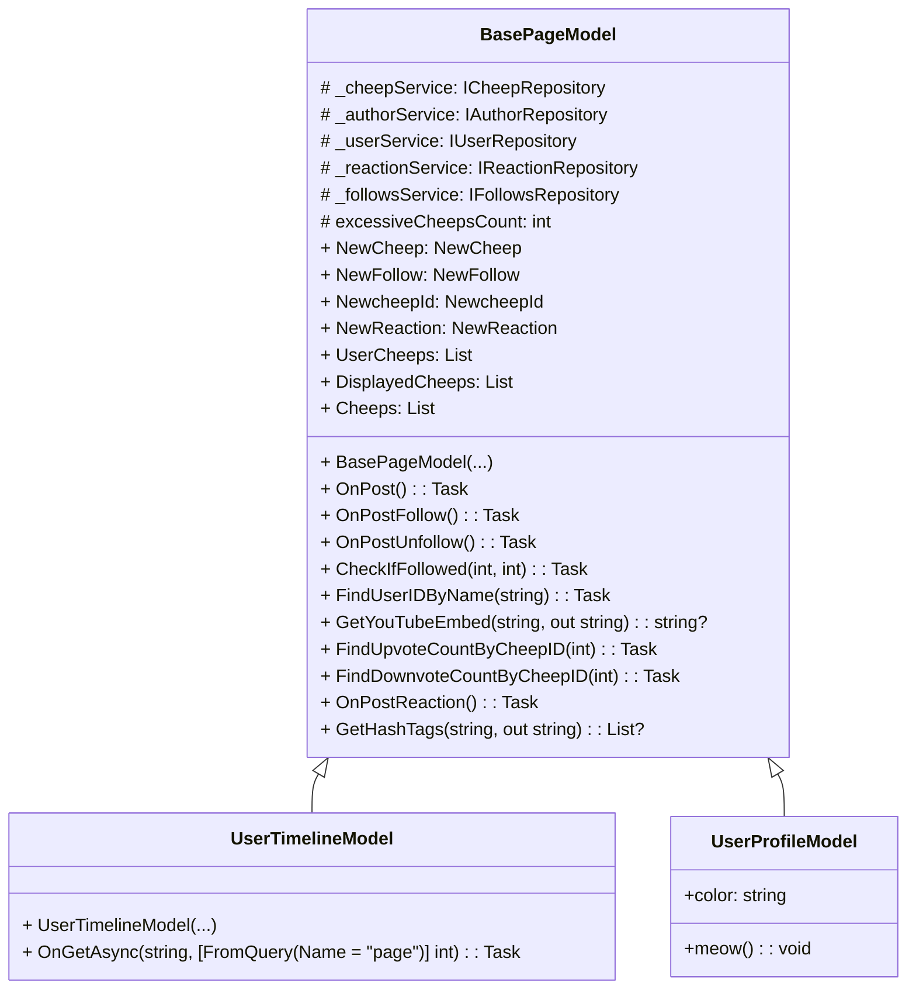

```mermaid
classDiagram
    class BasePageModel {
        # _cheepService: ICheepRepository<Cheep,Author>
        # _authorService: IAuthorRepository<Author,Cheep,User>
        # _userService: IUserRepository<User>
        # _reactionService: IReactionRepository<Reaction>
        # _followsService: IFollowsRepository<Follows>
        # excessiveCheepsCount: int
        + NewCheep: NewCheep
        + NewFollow: NewFollow
        + NewcheepId: NewcheepId
        + NewReaction: NewReaction
        + UserCheeps: List<CheepDTO>
        + DisplayedCheeps: List<CheepDTO>
        + Cheeps: List<CheepDTO>

        + BasePageModel(...)
        + OnPost(): Task<IActionResult>
        + OnPostFollow(): Task<IActionResult>
        + OnPostUnfollow(): Task<IActionResult>
        + CheckIfFollowed(int, int): Task<bool>
        + FindUserIDByName(string): Task<int>
        + GetYouTubeEmbed(string, out string): string?
        + FindUpvoteCountByCheepID(int): Task<int>
        + FindDownvoteCountByCheepID(int): Task<int>
        + OnPostReaction(): Task<IActionResult>
        + GetHashTags(string, out string): List<string>?
    }

    class UserTimelineModel {
        + UserTimelineModel(...)
        + OnGetAsync(string, [FromQuery(Name = "page")] int): Task<ActionResult>
    }

    class UserProfileModel {
        +color: string
        +meow(): void
    }

    BasePageModel <|-- UserTimelineModel
    BasePageModel <|-- UserProfileModel
```